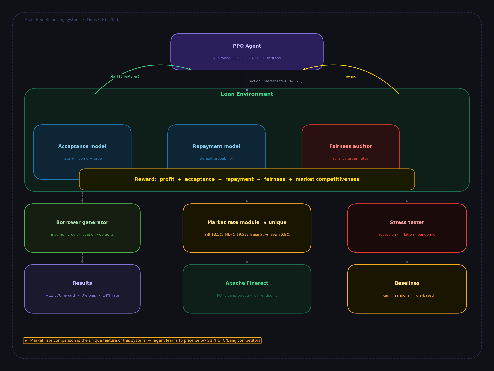
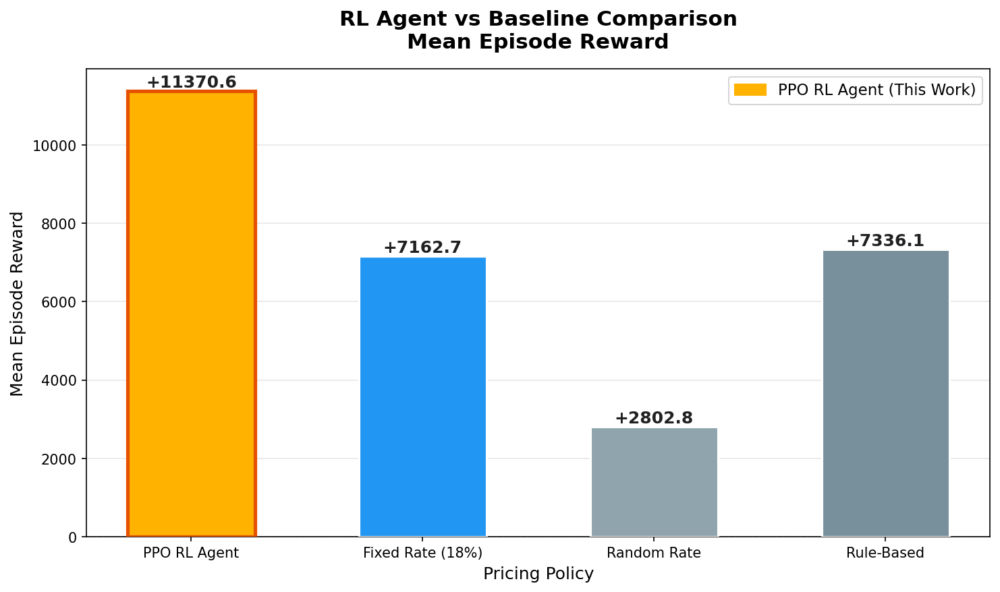
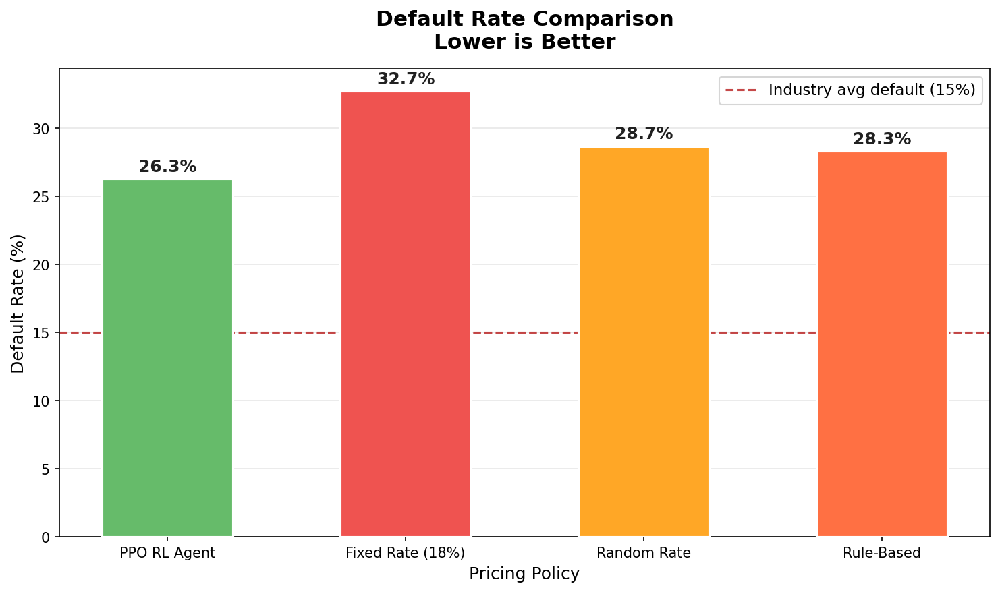
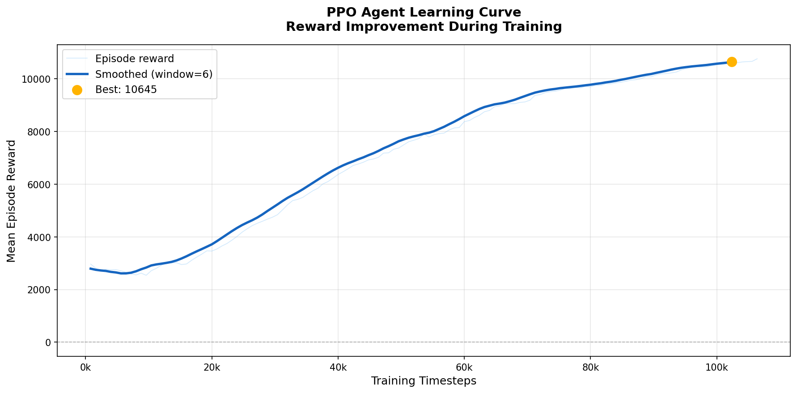
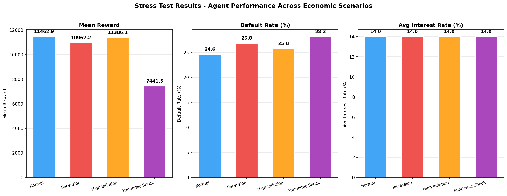
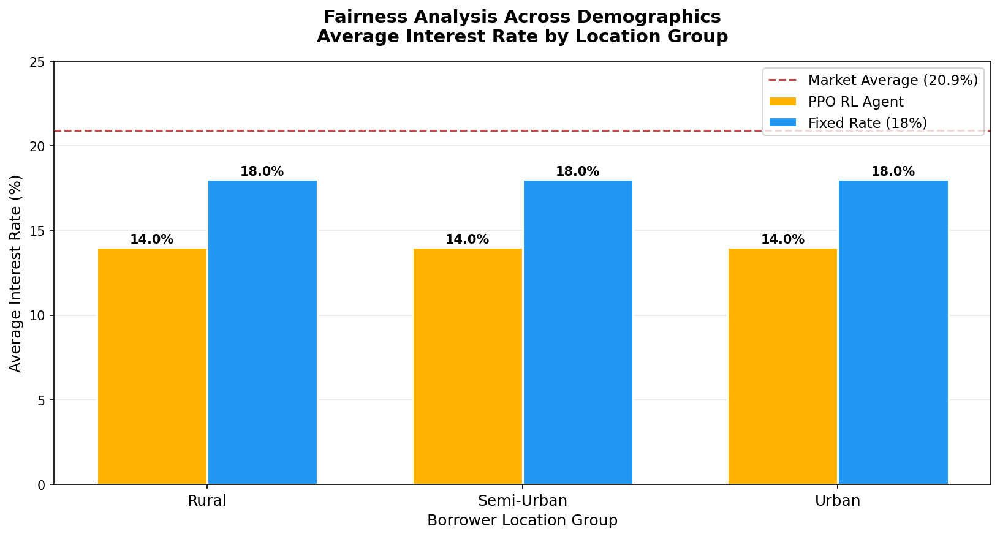

# 🏦 Micro-loan Dynamic Pricing Using Reinforcement Learning
### Mifos Initiative — Code For Good Tech DMP 2026

[](https://python.org)
[](https://gymnasium.farama.org)
[](https://stable-baselines3.readthedocs.io)
[](LICENSE)

---

## 📌 Problem Statement

Microfinance institutions (MFIs) serving low-income borrowers in emerging markets 
face a critical challenge: **how to price loans fairly, profitably, and sustainably**.

Traditional approaches use rigid rule-based tiers (high/medium/low income → fixed rate),
which fail to account for:
- Dynamic market competition (SBI, HDFC, Bajaj Finance, local MFIs)
- Borrower-specific repayment capacity
- Demographic fairness (rural vs urban, seasonal workers)
- Macroeconomic shocks (recession, inflation, pandemics)

This project trains a **Reinforcement Learning agent** to learn optimal interest rate 
policies that balance **profit**, **fairness**, and **financial inclusion** — 
aligning directly with the Mifos Initiative's mission.

---

## ✨ Unique Features

### 1. 🏪 Live Market Rate Comparison
The agent observes real competitor rates (SBI, HDFC, Bajaj Finance, local MFIs)
and receives bonus rewards for competitive pricing. Market rates fluctuate each
episode, forcing the agent to adapt dynamically.

### 2. ⚖️ Fairness Layer
A built-in fairness auditor tracks whether rural borrowers are being charged
disproportionately higher rates than urban borrowers with similar financial profiles.
Violations trigger negative rewards, teaching the agent to price equitably.

### 3. 🌪️ Economic Stress Testing
The trained agent is evaluated under 4 extreme scenarios — normal, recession,
high inflation, and pandemic shock — to verify robustness and reliability.

### 4. 📊 Multi-Objective Reward
The reward function balances 5 competing objectives simultaneously:
profit margin, loan acceptance, repayment success, market competitiveness,
and demographic fairness.

---

## 🏗️ Architecture





---

## 📁 Project Structure

```
micro-loan-rl-pricing/
├── README.md
├── requirements.txt
├── run_all.py                  ← Master pipeline script
├── environment/
│   ├── __init__.py
│   └── loan_env.py             ← Custom Gymnasium environment
├── agents/
│   ├── __init__.py
│   ├── train_ppo.py            ← PPO training (main agent)
│   └── train_dqn.py            ← DQN training (comparison)
├── evaluation/
│   ├── __init__.py
│   ├── baseline.py             ← Baseline comparison + Graphs 1,2
│   └── stress_test.py          ← Stress testing + Graphs 3,4,5
└── results/
    ├── ppo_microloan_model.zip ← Saved trained model
    └── graphs/
        ├── graph1_reward_comparison.png
        ├── graph2_default_rate_comparison.png
        ├── graph3_learning_curve.png
        ├── graph4_stress_test.png
        └── graph5_fairness_analysis.png
```

---

## 🚀 Installation

```bash
# 1. Clone the repo
git clone https://github.com/YOUR_USERNAME/micro-loan-rl-pricing.git
cd micro-loan-rl-pricing

# 2. Create virtual environment
python -m venv venv --without-pip

# 3. Activate (Windows)
.\venv\Scripts\Activate.ps1
# Activate (Mac/Linux)
source venv/bin/activate

# 4. Install pip and dependencies
python -m ensurepip --upgrade
pip install -r requirements.txt
```

---

## 🎯 How to Run

### Option A: Full Pipeline (Train + Evaluate + Graphs)
```bash
python run_all.py
```

### Option B: Train Only
```bash
python agents/train_ppo.py
```

### Option C: Skip Training (use existing model)
```bash
python run_all.py --skip-train
```

### Option D: Baseline Comparison Only
```bash
python evaluation/baseline.py
```

### Option E: Stress Tests Only
```bash
python evaluation/stress_test.py
```

---

## 📊 Results Summary







---

## 🔗 Connection to Apache Fineract

This prototype is designed to integrate with the
[Mifos X / Apache Fineract](https://fineract.apache.org/) platform:

| This Project | Fineract Integration Point |
|---|---|
| Borrower observation vector | Fineract client profile API |
| Interest rate action | `PUT /loanproducts/{productId}` endpoint |
| Acceptance/repayment feedback | Fineract loan lifecycle events |
| Market rate module | External rate feed → Fineract config |
| Fairness audit logs | Fineract report API |

The trained model can be deployed as a microservice that Fineract
calls when creating new loan offers, replacing static rate tables
with dynamic RL-driven pricing.

---

## 🔮 Future Work

- [ ] **Real data integration** — Train on actual Mifos/Fineract loan datasets
- [ ] **Multi-agent setup** — Simulate multiple competing MFIs
- [ ] **Continuous action space** — Use SAC/TD3 for smoother rate selection
- [ ] **Explainability layer** — SHAP values to explain each rate decision
- [ ] **REST API wrapper** — Flask/FastAPI endpoint for Fineract integration
- [ ] **Gender-aware fairness** — Explicit gender feature with fairness constraints
- [ ] **Federated learning** — Train across multiple MFIs without sharing data
- [ ] **Online learning** — Continuously update model from live repayment data

---

## 👤 Author

Built for the **Mifos Initiative DMP 2026** application.  
Demonstrates practical application of Reinforcement Learning
to financial inclusion challenges in emerging markets.

---

## 📄 License

MIT License — see [LICENSE](LICENSE) for details.